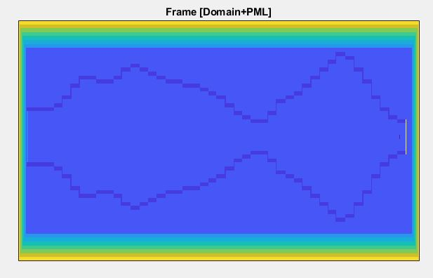
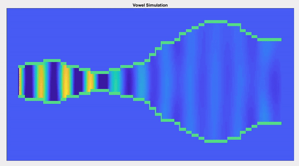

# Talking Tube: An Articulatory Speech Synthesis ToolBox

:golf: <b>Summary: </b>
 Talking Tube is a physics-based articulatory speech synthesizer, which can produce English vowel sounds. The model couples lumped-element vocal folds *(two-mass model)* with a novel 2D lightweight vocal tract model *(2.5D FDTD)* to generate synthetic audio output. The synthesizer uses the Finite-DIfference Time-Domain numerical scheme [3][4] to discretize acoustic components (pressure and velocity) on a staggered grid and computes the acoustic wave propagation. The proposed model *(2.5D FDTD)* is the extension of existing 2D FDTD vocal tract modelling approach and add a new impedance parameter *(tube depth)* [7] to its acoustic solver. And the acoustic anaysis of 2.5D FDTD vocal tract model has been proven to be precise when compared with a high-quality 3D FEM vocal tract model [6] and computationally much faster than the previous 2D vocal tract models [2]. The mid-saggital cross-sectional area is used [5] to construct the vocal tract contour on a 2D rectangular mesh from a 3D vocal tract MRI image.

The project was motivated from *"Aerophones In Flatland"* research article [1].

:tv: <b>How to run the synthesizer</b>
  To simulate static vowel sounds, run the talkingtube.m file in the MATLAB environemnt.

[STEP1] *<b>Enter 1 for 2D simulation or 0 for 2.5D simulation:</b>* Select the vocal tract model type.

[STEP2] *<b>Enter the sample rate multiplier:</b>* Determine simulation sampling rate as - (44100Hz * sample-rate-multiplier). For 2.5D FDTD,  sample-rate-multiplier with 15 (44100Hz * 15) provides precise acoustic simulation

[STEP3] *<b>Select simulation type:</b>* To simulate vowel-sound select 4.

[STEP4] *<b>Switch off PML Layers:</b>* Select 0

[STEP5] *<b>Choose the vowel sound:</b>* Select any of the following options (1-a, 2-u, 3-o, 4-i)

[STEP6] *<b>Swicth ON the circular baffle:</b>* Select 0

[STEP7] *<b>Apply area expansion ratio to boundary admittance:</b>* Select 0

[STEP8] *<b>Enter the open space depth: </b>* Select 0.5 for 2.5D FDTD simulation. ([Note] We don't need tube depth for 2D simulation)

[STEP9] *<b>Select acoustic source model:</b>* Select 4 for two mass model

:movie_camera:<b>YouTube Link: </b>
 [1] <a href = "https://www.youtube.com/watch?v=0wqWfBbIQtg">Arophones In Flatland: SIGGRAPH 2015 Talk</a>

:books: <b>References: </b>
 [1] <a href ="https://dl.acm.org/citation.cfm?id=2767001">"Aerophones in flatland: Interactive Wave Simulation Of Wind Instruments"</a>  by Andrew Allen, Nikunj Raghuvansi. 
 [2] <a href = "https://asa.scitation.org/doi/abs/10.1121/2.0000395">"Towards real-time two-dimensional wave propagation for articulatory speech synthesis"</a> by Victor Zappi, Arvind Vasuvedan, Andrew Allen, Nikunj Raghuvansi and Sidney Fels.
 [3]<a href="https://asa.scitation.org/doi/full/10.1121/1.3502470">"Acoustic Analysis of the vocal tract during vowel production by finite-difference time-domain method"</a> by Hironori Takemoto and Parham Mokhtari.
 [4]<a href = "https://www.jstage.jst.go.jp/article/ast/23/1/23_1_40/_article/-char/ja/">"Visualization of sound propagation and scattering in rooms"</a> by Takatoshi Yokota, Shinichi Sakamoto and Hideki Tachibana
 [5]<a href="https://asa.scitation.org/doi/10.1121/1.2805683">"Comparision of magnetic imaging-based vocal tract area functions obtained from the same speaker in 1994 and 2002"</a> by Brad H. Story
 [6]<a href = "https://asa.scitation.org/doi/10.1121/1.4837221">"Two dimensional vocal tracts with three-dimensional behaviour in the numerical generation of vowels"</a> by Marc Arnela and Oriol Guasch

:newspaper:<b>Publication:</b>
 Following is the research paper that comes out of this project. If you would like to use the code for your research, please consider citing this paper:
 [7] <a href="https://www.isca-speech.org/archive/Interspeech_2019/abstracts/1764.html">"An Extended Two-Dimensional Vocal Tract Model for Fast Acoustic Simulation of Single-Axis Symmetric Three-Dimensional Tubes"</a> by DR Mohapatra, Victor Zappt, Sidney Fels, INTERSPEECH 2019, Graz, Austria. [[Code]](https://github.com/Debasishray19/vocaltube-speech-synthesis/tree/master/version03) [[Talk Slide]](https://github.com/Debasishray19/vocaltube-speech-synthesis/blob/master/Interspeech2019%20Presentation/Interspeech%202019%20Presentation.pptx)

:mailbox:<b>[Note]:</b>
  To inquiry or for bugs/suggestions, please contact: debasishiter@gmail.com
 
